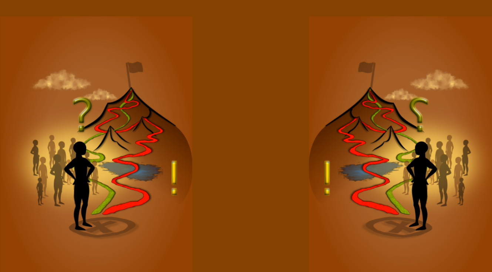

# 🖼️ Cesta a kontexty – príbeh učenia

---

## 🧍‍♂️ O obraze

Tento vizuál reprezentuje moju filozofiu prístupu k práci, učeniu a tímovej spolupráci. Je metaforou cesty, ktorou každý z nás prechádza.

### Významy:

1. **Postava vpredu** = Ja (alebo ktokoľvek čitateľ)
2. **Tiene/postavy za mnou** = moje roly, moji kolegovia, moje minulé verzie
3. **Zrkadlenie** = spätná väzba, ktorú dostávam od sveta a tímu
4. **Červená cesta** = minulosť, bolesť, múdrosť
5. **Zelená cesta** = rast, možnosť, nové porozumenie

---

## 🌀 Pointa

> **Neexistuje neúspech na ceste poznania.**
>  
> Existujú len ďalšie skúsenosti, ktoré nám pomáhajú dosiahnuť vytýčené ciele.

---

## 🧠 Ako to použiť

- Ako mapu: keď sa stratíš, pozri sa späť. Tiene ukazujú tvoje roly.
- Ako zrkadlo: v každom konflikte je šanca na rast.
- Ako súradnice: červená cesta ťa učí, zelená cesta ťa vedie.

---

## 🛠️ Kontext použitia

Tento obraz sa stal základom pre moje:
- GitHub kurzy a repozitáre (`GitDocs-Lab`)
- Prístup k výučbe predmetu *Systémové myslenie v IT*
- Vytváranie šablón pre osobné i tímové projekty

---

👉 Pokračuj na: [`sdlc.md`](sdlc.md) *(čoskoro)* – technické pokračovanie s nástrojmi, metódami a šablónami.
