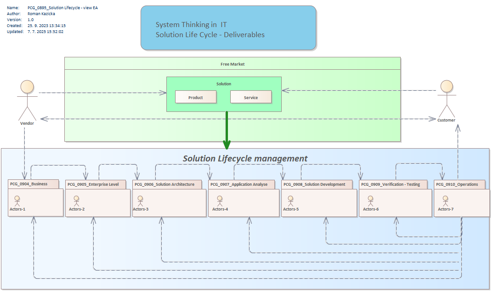

# 🧩 SDLC – Solution Development Life Cycle

> Technický základ pre všetky metodiky, ktoré používam v praxi aj výuke.

---

## 📌 1. O čom to je?
### V-Model – zjednodušený priebeh vývoja (podľa TforTesting)

https://tfortesting.wordpress.com/2012/11/20/v-model-for-testing/
Tento model ukazuje zrkadlovú štruktúru vývoja:
- V ľavo: návrh riešenia
- V pravo: jeho testovanie
- V strede: návrh testovania výstupov 

---

## 🔍 2. Prečo to je?

* Aby sme sa na ceste, cestách nestratili. Pre každé riešenia si vytvoríme priestor, ktorý má jasnú štruktúru, ktoré pomáha zachytiť všetky typy informácií počas životného cyklu riešenia.
* Môžeme pracovať na viacerých riešeniach súčasne, bez toho, aby sme sa stratili
* Systematicky budujeme riešenia, bez ohľadu či pracujeme ako One man show, alebo v tímoch
* Priebežne si budujeme znalostný systém
  
 
Kontext roly a výstupov – „Solution Lifecycle Management“

Tu vidíme:
- Zákazník ↔ Riešenie ↔ Tím
- Každý blok reprezentuje konkrétnu rolu, fázu a zodpovednosti
- Model je základom pre:
  - šablóny dokumentácie
  - výučbu
  - tímové procesy

---

## 🧠 3. A čo s tým?

Použi modely ako:
- 🧭 orientáciu v komplexných projektoch
- 🛠️ nástroj pri výuke študentov alebo školení kolegov
- 📐 rámec pre vlastné kurzy či konzultácie

---
## 🔍 3. Kontext roly a výstupov – „Solution Lifecycle Management“

Tu vidíme:
- Zákazník ↔ Riešenie ↔ Tím
- Každý blok reprezentuje konkrétnu rolu, fázu a zodpovednosti
- Model je základom pre:
  - šablóny dokumentácie
  - výučbu
  - tímové procesy

---
---
👉 Naspäť k príbehu: [`journey.md`](journey.md)
