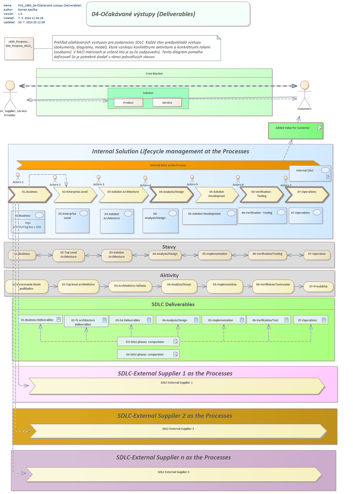

# 🧩 SDLC – Solution Development Life Cycle

> Technický základ pre všetky metodiky, ktoré používam v praxi aj vo výuke.

---

## 📌 1. **O čom to je?**

Zjednodušený pohľad na vývoj riešenia pomocou tzv. **V-modelu**  
[Inšpirované konceptom Testing-for-Testing](https://tfortesting.wordpress.com/2012/11/20/v-model-for-testing/)
https://tfortesting.wordpress.com/2012/11/20/v-model-for-testing/

  

V-model zobrazuje **zrkadlovú štruktúru vývoja**:

- Vľavo: návrhové fázy (od požiadaviek až po návrh modulov)
- Vpravo: testovacie fázy (od jednotkového testovania po akceptáciu)
- Dno „V“: fáza implementácie (kódovanie)

  

 ## **Čo nie je otestované je nefunkčné**

 

 * Preto každý systémový výstup je nutné overiť, či spĺňa očakávania.

  

---

## 🔍 2. **Prečo to je?**

> Aby sme sa na ceste (a často vo viacerých paralelných cestách) nestratili.

SDLC a jeho vizualizácie nám pomáhajú:

- Vytvoriť pre každé riešenie jasne definovaný priestor
- Udržať štruktúru pri spracovaní veľkého množstva informácií
- Pracovať paralelne na viacerých riešeniach bez chaosu
- Budovať konzistentne tímové aj individuálne riešenia
- Priebežne tvoriť **znalostný systém**

---

## 🧭 3. **A čo s tým?**

Vytvoril som niekoľko metodík na podporu rutinných aktivít počas SDLC, aby sa vytvoril vúčší priestor priestor pre kreativitu a vnímanie rôznych kontextov

 ### Moja vízia  
  *"Zdieľam vedomosti, aby rástli všetci okolo mňa."*

  

**Jedná sa o nasledovné metodiky:**
    - Context Aware Approach
      - Context Aware Systems
      - Context Aware Solutions
    - 7 Disciplines for Successful Solution
    - SDLC - Keep overview over SDLC of your solution
    - APV - Assets-Perspectives-Views - Keep order over Your assets
    - Q12 - Twelve quadrants for starting Your business successfully
    - Lean Canvas - Nine topics describing ypur new business 
  
  Tieto metodiky som implementoval do:
  1. Modelovacieho nástroja Enterprise Architect (Sparxsystems technologies)
  2. Github repository templates
   
Použi tieto modely ako:

- 🧭 Orientáciu v komplexných projektoch
- 🛠️ Nástroj vo výuke študentov alebo školení kolegov
- 📐 Rámec pre vlastné kurzy, dokumentáciu alebo konzultácie

---

## 🔍 4. **Kontext roly a výstupov – Solution Lifecycle Management**

  

Tento model zobrazuje:

- **Zákazník ↔ Riešenie ↔ Tím**: trojica, v ktorej sa pohybuje každé riešenie
- Každý blok: fázu, rolu, zodpovednosti, výstupy
- Význam pre:
  - 📄 Šablóny a dokumentáciu
  - 👨‍🏫 Výučbu a metodiku
  - 🤝 Tímovú koordináciu a konzistentné doručovanie

---

👉 Späť k príbehu: [`journey.md`](journey.md)
